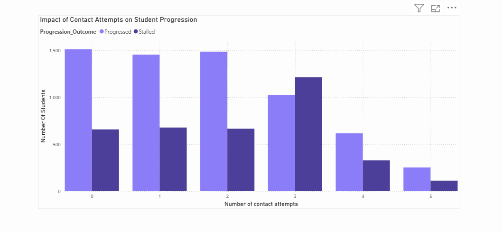
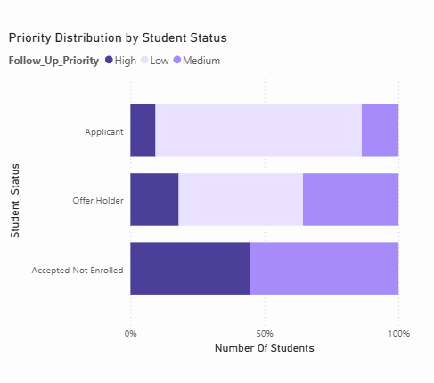
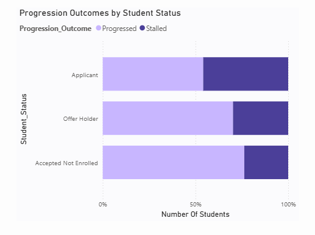
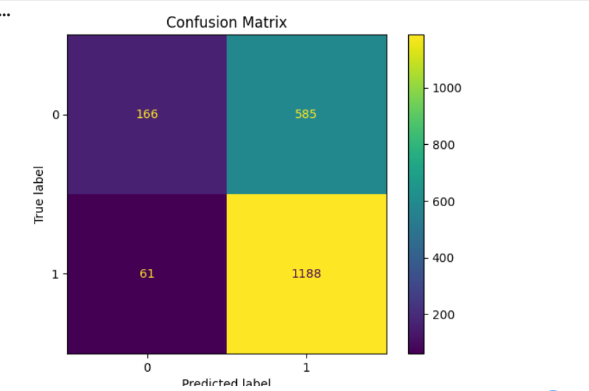
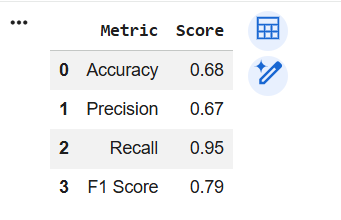

# 🎓 Student Follow-Up Prioritisation & Enrolment Support Analytics

## Project Overview

This project analyses student progression and enrolment behaviour to identify workload drivers, progression barriers and students requiring prioritised follow-up support.

The solution combines SQL analysis, Power BI visualisation and predictive modelling in Python to support data-driven decision making within the student enrolment lifecycle.

---

## Business Problem

Student conversion teams manage large applicant pipelines and must prioritise follow-up activities effectively. Without clear visibility into progression patterns and workload drivers, resources may be allocated inefficiently.

This project was developed to:

- Identify key workload drivers
- Analyse progression patterns across enrolment stages
- Detect students at risk of stalling
- Support evidence-based follow-up prioritisation

---

## Tools Used

- Power BI
- SQL
- Python
- Pandas
- Scikit-Learn
- DAX

---

## Project Workflow

Data Collection & Cleaning

↓

SQL Analysis

↓

Power BI Dashboard Development

↓

Predictive Modelling

↓

Business Recommendations

---

## Key Findings

- T1 Enrolment generated the highest follow-up workload.
- Applicants demonstrated the lowest progression rates.
- Progression rates declined after multiple contact attempts.
- Predictive modelling identified factors associated with stalled progression.

---

## Predictive Modelling

A Random Forest Classifier was developed to predict whether a student would progress or stall within the enrolment lifecycle. The model utilised operational and engagement-related features including student status, follow-up priority, outstanding actions, contact attempts, program information, academic events, and days until commencement.

### Model Performance

| Metric                 | Score |
| ---------------------- | ----- |
| Accuracy               | 68%   |
| Precision (Progressed) | 67%   |
| Recall (Progressed)    | 95%   |
| F1 Score (Progressed)  | 79%   |

The model demonstrated strong capability in identifying students likely to progress, achieving a recall of 95% for progressed students. This indicates that the model successfully captured the majority of students who ultimately progressed through the enrolment process.

### Confusion Matrix Analysis

The confusion matrix highlights the model's prediction outcomes across progressed and stalled students. While the model performed well in identifying progressed students, performance was lower for stalled students, suggesting that class imbalance may have influenced prediction accuracy.

### Feature Importance

Feature importance analysis identified Follow-Up Priority, Outstanding Actions, and Contact Attempts as the strongest predictors of student progression outcomes. These findings support the operational importance of targeted interventions and timely follow-up activities within the student conversion process.

### Limitations and Future Improvements

The model showed stronger performance for progressed students than stalled students, indicating opportunities for further improvement through class-balancing techniques, hyperparameter tuning, and additional feature engineering. Future iterations could also explore alternative machine learning algorithms to improve identification of at-risk students.

## Dashboard Preview

### Dashboard Overview

### Priority Distribution And Progression Analysis

---
## Predictive Modelling Results

---

## Business Recommendations

- Prioritise intervention during high-volume intake periods.
- Focus resources on applicants demonstrating progression risk.
- Implement risk-based follow-up workflows.
- Monitor progression outcomes through ongoing dashboard reporting.

---

## Author

Anupama Shaji

Master of Information Systems | Data Analytics | Business Intelligence
