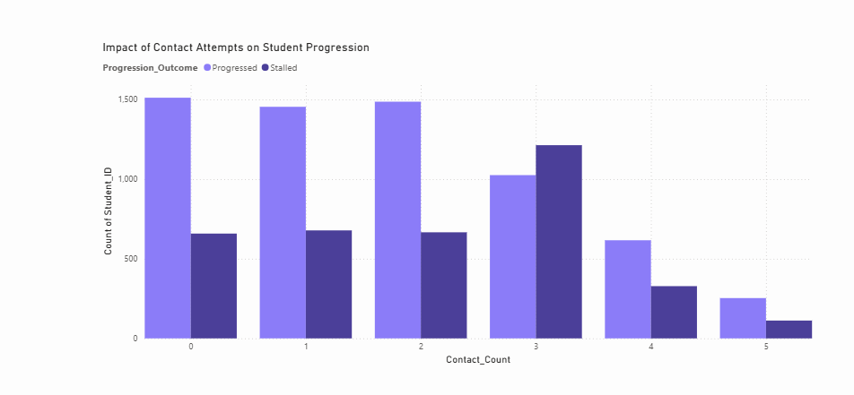
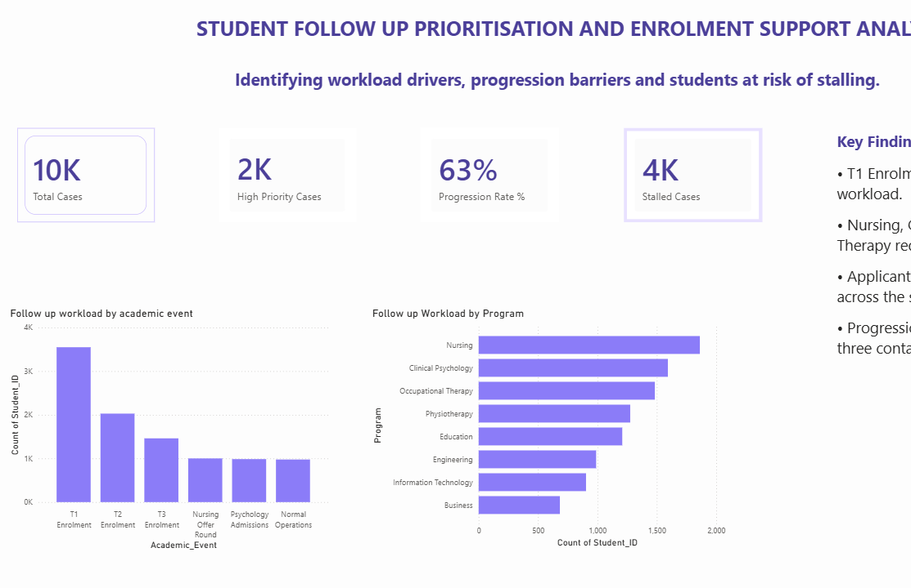
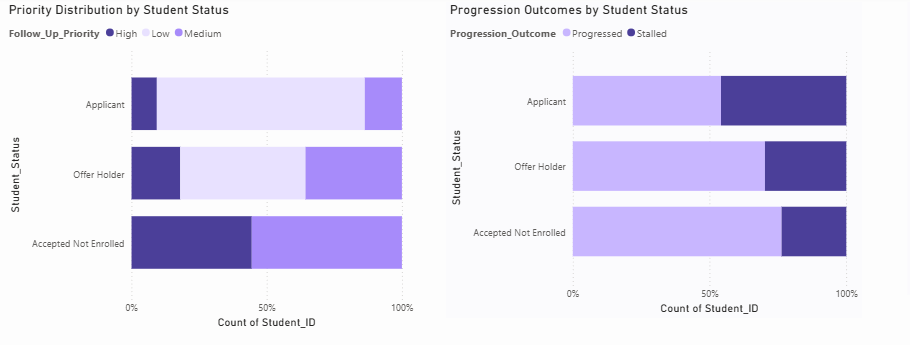
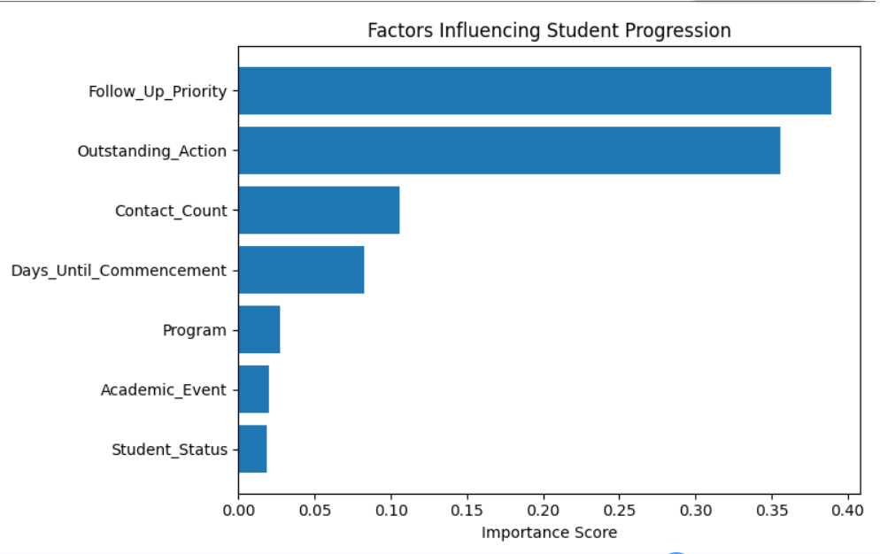

# 🎓 Student Follow-Up Prioritisation & Enrolment Support Analytics

## Project Overview

This project analyses student progression and enrolment behaviour to identify workload drivers, progression barriers and students requiring prioritised follow-up support.

The solution combines SQL analysis, Power BI visualisation and predictive modelling in Python to support data-driven decision making within the student enrolment lifecycle.

---

## Business Problem

Student conversion teams manage large applicant pipelines and must prioritise follow-up activities effectively. Without clear visibility into progression patterns and workload drivers, resources may be allocated inefficiently.

This project was developed to:

- Identify key workload drivers
- Analyse progression patterns across enrolment stages
- Detect students at risk of stalling
- Support evidence-based follow-up prioritisation

---

## Tools Used

- Power BI
- SQL
- Python
- Pandas
- Scikit-Learn
- DAX

---

## Project Workflow

Data Collection & Cleaning

↓

SQL Analysis

↓

Power BI Dashboard Development

↓

Predictive Modelling

↓

Business Recommendations

---

## Key Findings

- T1 Enrolment generated the highest follow-up workload.
- Applicants demonstrated the lowest progression rates.
- Progression rates declined after multiple contact attempts.
- Predictive modelling identified factors associated with stalled progression.

---

## Dashboard Preview

### Dashboard Overview

### Workload Analysis

### Priority Distribution And Progression Analysis

---
## Predictive Modelling Results

---

## Business Recommendations

- Prioritise intervention during high-volume intake periods.
- Focus resources on applicants demonstrating progression risk.
- Implement risk-based follow-up workflows.
- Monitor progression outcomes through ongoing dashboard reporting.

---

## Author

Anupama Shaji

Master of Information Systems | Data Analytics | Business Intelligence
